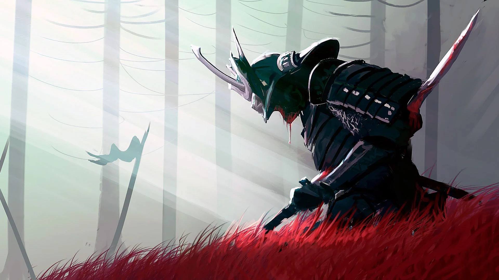
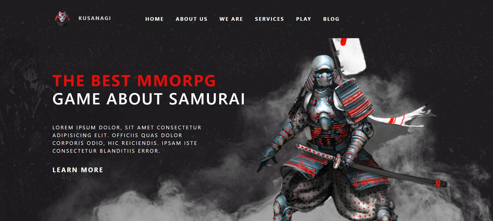
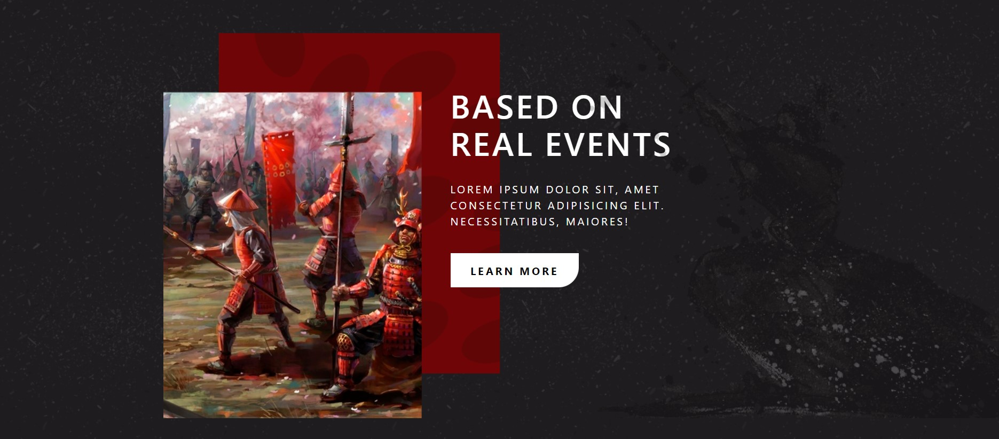
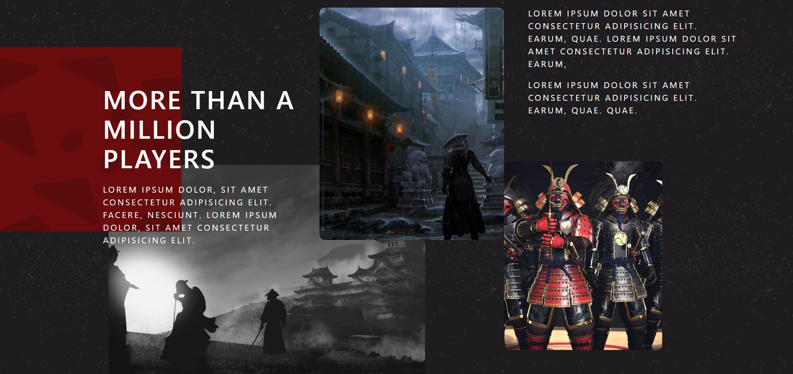

<h1 align="center">
    
</h1>

# Summary

- [Description](#📝-Description)
- [Project](#💻-Project)
- [Technologies](#🚀-Technologies)
- [Project Stats](#🎯-Project-Stats)

---

## 📝 Description

> This is a project that i've create this inspired by a layout from Behance.net  
> I've decided to do this project to train my skills with the React framework.  
> Original Project in Behance: https://www.behance.net/gallery/131626947/Web-Design-For-MMMORPG?tracking_source=search_projects%7Cwebsite%20game%20landingpage  
> My purpose while developing this is to make a simple and clean landingpage with a nice user experience.

---

## 💻 Project

<h1 align="center">
    
</h1>
<h1 align="center">
    
</h1>
<h1 align="center">
    
</h1>

---

## 🚀 Technologies
This project was developed with the following technologies:
* VS Code;
* HTML;
* CSS;
* Bootstrap;
* Javascript;
* React;

---

## 🎯 Project Stats

<strong>This project is under developement.</strong>

---

## :heavy_check_mark: To do list

- This project is under developement.

---

## :handshake: Become a Contributor

Do you have any ideas that you want to implement it? It's simple!

1. Fork the project
2. Modify what you think is necessary
3. Commit the changes
4. Create a Pull Request

---

## Author

- Projetos - [Lucass2021](https://github.com/Lucass2021)

- Linkedin - [@Lucas Dias da Silva](https://www.linkedin.com/in/lucas-dias-da-silva-118954199/)

- Email - [Lucas Dias](mailto:lucas.allx@hotmail.com")
